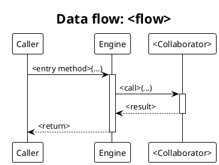

# Render TUI diagrams

`docs/architecture/` holds the TUI engine's architecture diagrams as PlantUML sources (`.puml`) plus rendered `.svg`:

- `architecture.puml` - layered component architecture
- `dataflow-collect.puml` - the headless collection lifecycle (a sequence diagram)
- `dataflow-tui.puml` - the interactive panel-TUI loop (a sequence diagram)
- `README.md` - a narrative walkthrough that explains how the TUI is set up and how it runs, embedding the rendered SVGs as supporting visuals (not a bare index)

Each `.puml` renders to a light `<name>.svg`, and a dark-scheme `<name>-dark.svg` is derived from that light render by `docs/util/derive-dark-diagram.js`. Both are committed and served so the diagrams read well in light and dark browsers.

All content is derived from the source under `src/` (the packages are the `src/` subdirectories; the lifecycle is what `Engine::collect()` and `PanelController::run()` do), never from design docs. If the docs and the code disagree, the code wins.

## Prerequisite

PlantUML must be on the PATH:

```bash
plantuml -version
```

If it is missing, install it with `brew install plantuml` (it needs Java, which is already present on macOS).

## Task A - regenerate every SVG

After editing any `.puml`, re-render all light SVGs from the package root, then derive their dark variants, then confirm each `.svg` changed and stop:

```bash
plantuml -tsvg docs/architecture/*.puml
node docs/util/derive-dark-diagram.js docs/architecture/*.svg
```

The light render stays the single source of truth; the dark variant is derived from it by remapping a fixed palette (see Conventions), so the two can never drift. The `*.svg` glob is safe - the deriver skips inputs already ending in `-dark.svg`. A colour outside the palette aborts the derivation on purpose: map the new colour in `docs/util/derive-dark-diagram.js` rather than working around it. `derive-dark-diagram.js` is covered by `docs/tests/unit/derive-dark-diagram.test.js`; run `npm --prefix docs test` after touching it.

## Task B - add a new data-flow diagram

1. **Trace the flow from source.** Pick the entry method (e.g. `Engine::collect()`, `PanelController::run()`) and follow it through the classes it calls: `InputResolver`, the discovery specs, `Deriver` + `Derive` + `Transform`, `Condition`, `HandlerRegistry` (reusable static behaviour), then `Answers` / `Theme` / `WidgetFactory` on the way out.
2. **Create** `docs/architecture/dataflow-<flow>.puml` from the template below.
3. **Fill** the participants and messages from the real call path: solid arrows (`->`) for the forward path, dashed (`-->`) for returns. Mirror `dataflow-collect.puml`.
4. **Render and derive** it: `plantuml -tsvg docs/architecture/dataflow-<flow>.puml`, then `node docs/util/derive-dark-diagram.js docs/architecture/dataflow-<flow>.svg` for the dark variant.
5. **Index** it in the README walkthrough (`docs/architecture/README.md`) with a `<picture>` that swaps the dark variant on GitHub:

   ```html
   <picture>
     <source media="(prefers-color-scheme: dark)" srcset="dataflow-<flow>-dark.svg">
     " src="dataflow-<flow>.svg">
   </picture>
   ```
6. **Embed** it in the Docusaurus page (`docs/content/architecture.mdx`) with `<ThemedImage>` so it follows the site's dark-mode toggle:

   ```jsx
   <ThemedImage alt="<caption>" sources={{light: useBaseUrl('/dataflow-<flow>.svg'), dark: useBaseUrl('/dataflow-<flow>-dark.svg')}} width="100%" />
   ```

### Template



## Task C - keep the walkthrough current

`docs/architecture/README.md` is a walkthrough, not an index: it walks the reader through describing a config, attaching handlers, the headless collection lifecycle and the interactive TUI, embedding `architecture.svg`, `dataflow-collect.svg` and `dataflow-tui.svg` at the points they support. After any structural change (a new package, a changed lifecycle step, a new diagram), update the prose so it still matches `src/`, and embed any new SVG where it supports the narrative. Always regenerate the SVGs (Task A) in the same pass so the visuals and the prose agree.

## Conventions

- Keep the sequence-diagram header (`!theme plain`, the Helvetica skinparams, `title Data flow: ...`) identical across diagrams so they read as a set.
- Package colours in `architecture.puml` are keyed by role: config blue (`#E3F2FD`), engine orange (`#FFF3E0`), resolution green (`#E8F5E9`), handlers purple (`#F3E5F5`), output/input slate (`#ECEFF1`), interactive red (`#FFEBEE`). Reuse them if a new diagram needs layer colours.
- The dark variant is derived, never hand-drawn: `docs/util/derive-dark-diagram.js` maps the light palette to a dark one - white page to transparent, `#FFFFFF` fills to the `#3b3b3d` surface, `#000000` to `#e3e3e3`, and each package pastel to a hue-preserving dark tint (builder `#33351a`, config `#193249`, core `#40301b`, resolution `#1b3423`, handlers `#332536`, output `#282d31`, interactive `#3b2226`). Add any new package colour to that map or Task A's derivation aborts.
- **Escape a leading pair of `-` in labels.** PlantUML's Creole renders a pair of `--` as strikethrough; write such labels with `~--` if you must show a CLI flag.
