<p align="center">
  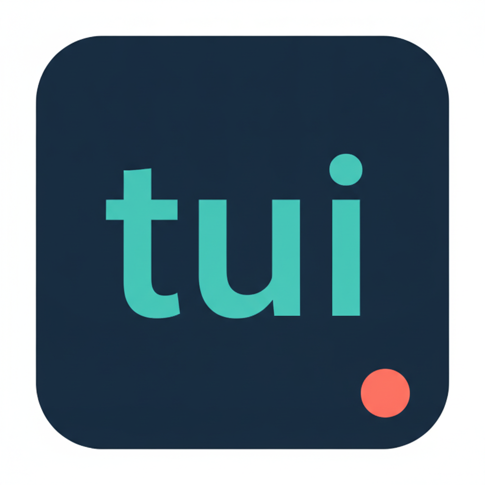
</p>

<h1 align="center">Panel-based terminal forms for PHP</h1>

<div align="center">

[](https://github.com/drevops/tui/issues)
[](https://github.com/drevops/tui/pulls)
[](https://github.com/drevops/tui/actions/workflows/test-php.yml)
[](https://codecov.io/gh/drevops/tui)


</div>

---

<p align="center">
  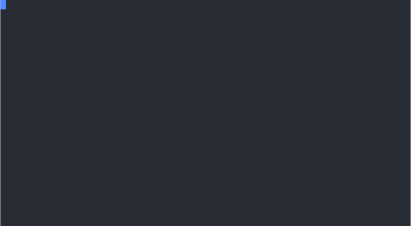
</p>

A dependency-light PHP engine for building **panel-based terminal forms**: interactive, keyboard-driven questionnaires that collect answers and hand them to your code. Describe the questions in PHP with a fluent builder, add a handler class wherever a question needs real behaviour, and the engine renders a scrollable, themeable TUI - or runs headless from a JSON payload.

It powers the [Vortex](https://www.vortextemplate.com) project installer, but knows nothing about Vortex: the engine is generic, the project-specific questions and handlers live in the consumer, and **applying the collected answers is the consumer's job, not the TUI's**.

## Features

- 🧭 [**Panel TUI**](#panels-and-navigation) - a full-screen, scrollable, keyboard-driven form: panels hold fields, sub-panels drill in to any depth
- 🧩 [**Widgets**](#widgets) - `text`, `number`, `textarea`, `password`, `select`, `multiselect`, `suggest`, `search`, `multisearch`, `confirm`, `toggle`, `pause`
- 🏗️ [**Builder-driven**](#configuration) - panels and fields are declared in PHP with a fluent builder; the common cases need no code
- 🤖 [**Interactive or headless**](#headless-collection) - drive the panel TUI by keyboard, or collect answers non-interactively from a JSON payload and environment variables (and emit a JSON schema for agents and forms)
- 🔗 [**Derived values**](#derived-values) - compute one field from others with [str2name](https://github.com/AlexSkrypnyk/str2name) transforms; chains settle to a fixpoint
- 🔀 [**Conditional fields**](#conditional-fields) - show or hide fields with `when` rules; a fix-up pass reconciles dependent answers
- 🔍 [**Discovery**](#discovery) - detect sensible defaults from the target directory (`.env` keys, JSON paths, path existence, directory scans)
- ⚙️ [**Declared behaviour**](#field-behaviour) - validation, transforms and dynamic defaults as closures on the field; per-field handler classes remain as a fallback
- 📦 [**Self-describing answers**](#self-describing-answers) - each answer carries a snapshot of its question and its provenance; summaries need no form config
- 🎨 [**Themes**](#themes) - the whole visual representation (colours, glyphs, layout) is a theme class; ships with dark and light
- ⌨️ [**Key bindings**](#key-bindings) - remap navigation, edit, accept and cancel keys per widget type; ships a vim-style preset, and a bad binding fails loudly at build time
- ✨ [**Unicode and ASCII**](#display-modes) - glyphs follow the terminal locale and colour honours `NO_COLOR`; both can be forced on the form

## Installation

```bash
composer require drevops/tui
```

## Quick start

Declare a form with the fluent `Form` builder, then drive it with the `Tui` facade - one class that wires the engine, resolver, schema tools and TUI for you:

```php
use DrevOps\Tui\Builder\Form;
use DrevOps\Tui\Builder\PanelBuilder;
use DrevOps\Tui\Tui;

$form = Form::create('My form')
  ->panel('general', 'General', fn(PanelBuilder $p) => $p->text('name', 'Your name')->required());

$tui = new Tui($form, ['App\\Handler']);

// Interactive panel TUI on a terminal, headless otherwise.
$answers = $tui->run();

// Or call a mode directly:
echo $tui->collect('{"name":"Ada"}')->toJson();  // headless: JSON + environment
$answers = $tui->interact();                     // interactive panel TUI
```

It also exposes `schema()`, `agentHelp()` and `validate()`, and - when you want finer control - the internals via `config()`, `engine()` and `registry()`. See [`playground/`](playground) for complete, runnable examples.

## Widgets

Twelve widget types cover text entry, choices and gates. Every field of the form opens its widget in an editor; the same widgets also run standalone (see [`playground/3-widgets/`](playground/3-widgets)). Widgets pull their glyphs and colours from the theme, so each one below is shown in all four display modes.

<p align="center">
  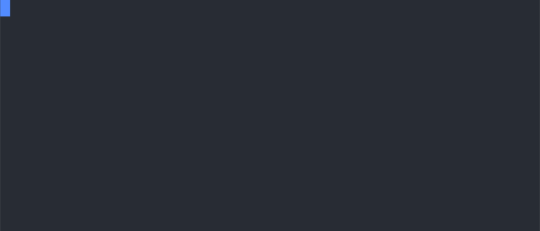
</p>

### Text

Single-line text input with a movable caret. Type to insert, Left/Right move the caret, Backspace deletes, Enter accepts.

```php
$p->text('name', 'Site name')->default('Acme Site')->required();
```

<table>
  <tr>
    <td></td>
    <td align="center"><strong>ANSI</strong></td>
    <td align="center"><strong>No ANSI</strong></td>
  </tr>
  <tr>
    <td align="right"><strong>Unicode</strong></td>
    <td>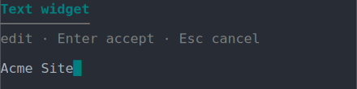</td>
    <td>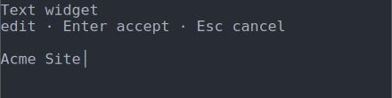</td>
  </tr>
  <tr>
    <td align="right"><strong>ASCII</strong></td>
    <td>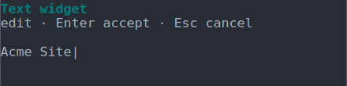</td>
    <td>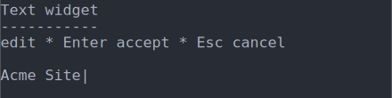</td>
  </tr>
</table>

### Number

Integer input: digits with an optional leading minus, accepted as an `int`.

```php
$p->number('port', 'HTTP port')->default(8080);
```

<table>
  <tr>
    <td></td>
    <td align="center"><strong>ANSI</strong></td>
    <td align="center"><strong>No ANSI</strong></td>
  </tr>
  <tr>
    <td align="right"><strong>Unicode</strong></td>
    <td>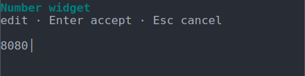</td>
    <td></td>
  </tr>
  <tr>
    <td align="right"><strong>ASCII</strong></td>
    <td>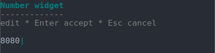</td>
    <td>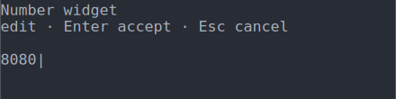</td>
  </tr>
</table>

Declare optional `min`, `max` and `step` to bound the value and enable keyboard adjustment. Up and Down then adjust the value by the step (defaulting to `1`), clamped to the range, and an entry outside the range is rejected inline with a clear message. The bounds are enforced headlessly too - a `--prompts` or environment value outside the range is rejected - and are reflected in the JSON schema as `min`, `max` and `step` on the prompt. With none declared the field stays a plain integer entry with the arrow keys inert.

```php
$p->number('port', 'HTTP port')->min(1)->max(65535)->step(1)->default(8080);
```

### Textarea

Multi-line text input: Enter inserts a newline, Up/Down move between lines keeping the column, Tab accepts.

```php
$p->textarea('notes', 'Provisioning notes')->default("Redis for cache\nSolr for search");
```

Call `->externalEditor()` to let the field hand off to the user's `$EDITOR` (or `$VISUAL`) for composing long or structured text. Pressing `Ctrl-E` while editing suspends the TUI, opens the editor seeded with the current value, and captures the saved buffer on return - saving and exiting commits it as the field value, while an aborted edit (a non-zero editor exit) keeps the inline value. When no editor is available the option is silently ignored and the field behaves as a plain inline textarea.

```php
$p->textarea('notes', 'Provisioning notes')->externalEditor();
```

<table>
  <tr>
    <td></td>
    <td align="center"><strong>ANSI</strong></td>
    <td align="center"><strong>No ANSI</strong></td>
  </tr>
  <tr>
    <td align="right"><strong>Unicode</strong></td>
    <td>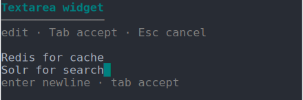</td>
    <td>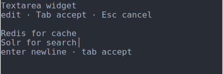</td>
  </tr>
  <tr>
    <td align="right"><strong>ASCII</strong></td>
    <td>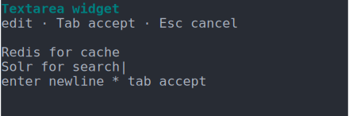</td>
    <td>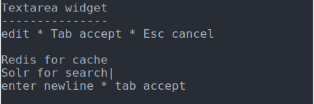</td>
  </tr>
</table>

### Password

Text input rendered as a mask - in the editor, on the panel row and in the summary; the accepted value stays plain for the consumer.

```php
$p->password('api_key', 'API key');
```

Two opt-in options, both off by default so the behaviour above is unchanged:

- `revealable()` adds a reveal toggle. Press Tab in the editor to cycle the display between hidden (nothing shown), masked and plaintext. This only changes what is drawn - the stored value is never affected, and the panel row and summary stay masked.
- `confirm()` prompts for the value a second time and rejects a mismatch with a clear message before accepting.

```php
$p->password('api_key', 'API key')->revealable()->confirm();
```

<table>
  <tr>
    <td></td>
    <td align="center"><strong>ANSI</strong></td>
    <td align="center"><strong>No ANSI</strong></td>
  </tr>
  <tr>
    <td align="right"><strong>Unicode</strong></td>
    <td>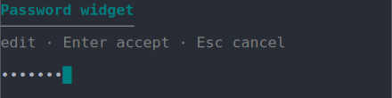</td>
    <td>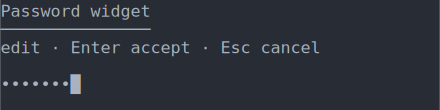</td>
  </tr>
  <tr>
    <td align="right"><strong>ASCII</strong></td>
    <td>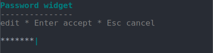</td>
    <td>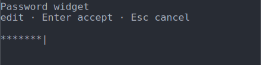</td>
  </tr>
</table>

With `revealable()` on, pressing Tab in the editor reveals the value and the hint line shows the toggle:

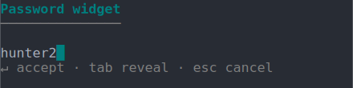

### Select

Single choice from a list. Up/Down move, Enter accepts the highlighted option. Pass `default` (an option key) to start on an option other than the first.

```php
$p->select('profile', 'Install profile')->default('minimal')->options(['standard' => 'Standard', 'minimal' => 'Minimal', 'demo_umami' => 'Demo Umami']);
```

<table>
  <tr>
    <td></td>
    <td align="center"><strong>ANSI</strong></td>
    <td align="center"><strong>No ANSI</strong></td>
  </tr>
  <tr>
    <td align="right"><strong>Unicode</strong></td>
    <td>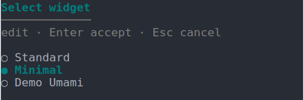</td>
    <td>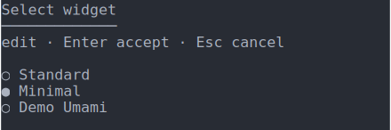</td>
  </tr>
  <tr>
    <td align="right"><strong>ASCII</strong></td>
    <td>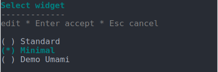</td>
    <td>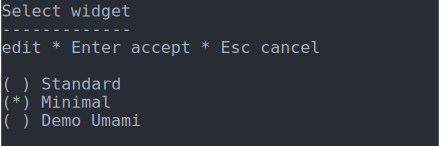</td>
  </tr>
</table>

### MultiSelect

Multiple choice from a checkbox list. Space toggles the highlighted option, typing narrows the list, Right selects and Left deselects everything visible, Enter accepts. Pass `default` (a list of option keys) to pre-check options - ideal for opt-out lists.

```php
$p->multiselect('services', 'Services')->default(['redis'])->options(['redis' => 'Redis', 'solr' => 'Solr', 'clamav' => 'ClamAV']);
```

<table>
  <tr>
    <td></td>
    <td align="center"><strong>ANSI</strong></td>
    <td align="center"><strong>No ANSI</strong></td>
  </tr>
  <tr>
    <td align="right"><strong>Unicode</strong></td>
    <td>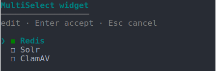</td>
    <td>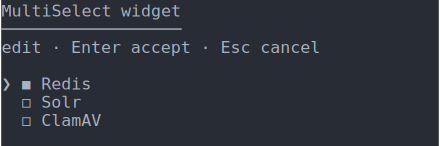</td>
  </tr>
  <tr>
    <td align="right"><strong>ASCII</strong></td>
    <td>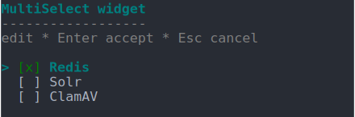</td>
    <td>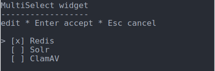</td>
  </tr>
</table>

### Suggest

Free text with autocomplete over a fixed option set: type anything, Up/Down highlight a matching suggestion, Enter accepts the highlighted suggestion or the typed text as-is.

```php
$p->suggest('php_version', 'PHP version')->default('8.4')->options(['8.1' => '8.1', '8.2' => '8.2', '8.3' => '8.3', '8.4' => '8.4']);
```

<table>
  <tr>
    <td></td>
    <td align="center"><strong>ANSI</strong></td>
    <td align="center"><strong>No ANSI</strong></td>
  </tr>
  <tr>
    <td align="right"><strong>Unicode</strong></td>
    <td>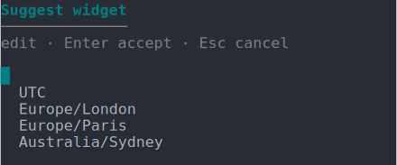</td>
    <td>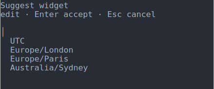</td>
  </tr>
  <tr>
    <td align="right"><strong>ASCII</strong></td>
    <td>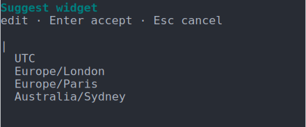</td>
    <td></td>
  </tr>
</table>

### Search

Single choice with a visible type-to-filter line above the options: typing narrows the labels, Up/Down move, Enter accepts the highlighted option's key.

```php
$p->search('timezone', 'Timezone')->default('london')->options(['utc' => 'UTC', 'london' => 'Europe/London', 'paris' => 'Europe/Paris', 'sydney' => 'Australia/Sydney']);
```

<table>
  <tr>
    <td></td>
    <td align="center"><strong>ANSI</strong></td>
    <td align="center"><strong>No ANSI</strong></td>
  </tr>
  <tr>
    <td align="right"><strong>Unicode</strong></td>
    <td>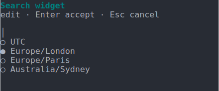</td>
    <td>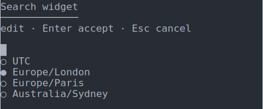</td>
  </tr>
  <tr>
    <td align="right"><strong>ASCII</strong></td>
    <td>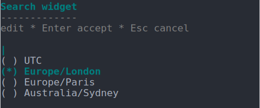</td>
    <td>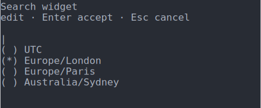</td>
  </tr>
</table>

### MultiSearch

A multi-select whose type-to-filter query is shown as a search line: type to narrow, Space toggles, Enter accepts the checked set.

```php
$p->multisearch('services', 'Services')->default(['redis'])->options(['redis' => 'Redis', 'solr' => 'Solr', 'clamav' => 'ClamAV', 'memcached' => 'Memcached']);
```

<table>
  <tr>
    <td></td>
    <td align="center"><strong>ANSI</strong></td>
    <td align="center"><strong>No ANSI</strong></td>
  </tr>
  <tr>
    <td align="right"><strong>Unicode</strong></td>
    <td>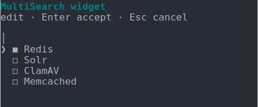</td>
    <td>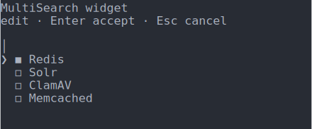</td>
  </tr>
  <tr>
    <td align="right"><strong>ASCII</strong></td>
    <td>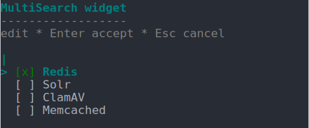</td>
    <td>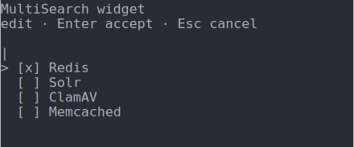</td>
  </tr>
</table>

### Confirm

Yes/No toggle. Arrows or Space switch, `y`/`n` set the choice directly, Enter accepts.

```php
$p->confirm('cdn', 'Serve via CDN?')->default(TRUE);
```

<table>
  <tr>
    <td></td>
    <td align="center"><strong>ANSI</strong></td>
    <td align="center"><strong>No ANSI</strong></td>
  </tr>
  <tr>
    <td align="right"><strong>Unicode</strong></td>
    <td></td>
    <td>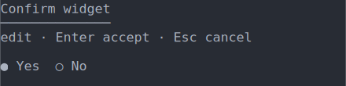</td>
  </tr>
  <tr>
    <td align="right"><strong>ASCII</strong></td>
    <td>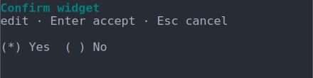</td>
    <td></td>
  </tr>
</table>

### Toggle

An inline switch between two labeled values. Arrows or Space flip, the first letter of each label sets the choice directly, Enter accepts. Pass `default` (an option value) to start on the other value.

```php
$p->toggle('telemetry', 'Telemetry')->options(['enabled' => 'Enabled', 'disabled' => 'Disabled'])->default('enabled');
```

<table>
  <tr>
    <td></td>
    <td align="center"><strong>ANSI</strong></td>
    <td align="center"><strong>No ANSI</strong></td>
  </tr>
  <tr>
    <td align="right"><strong>Unicode</strong></td>
    <td>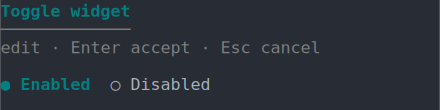</td>
    <td>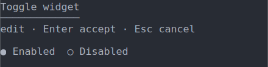</td>
  </tr>
  <tr>
    <td align="right"><strong>ASCII</strong></td>
    <td>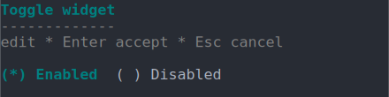</td>
    <td>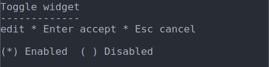</td>
  </tr>
</table>

### Pause

An acknowledgement gate: Enter (or Space) accepts `TRUE`. Headless runs auto-acknowledge it, so it never blocks automation.

```php
$p->pause('ready', 'Review the summary above');
```

<table>
  <tr>
    <td></td>
    <td align="center"><strong>ANSI</strong></td>
    <td align="center"><strong>No ANSI</strong></td>
  </tr>
  <tr>
    <td align="right"><strong>Unicode</strong></td>
    <td></td>
    <td>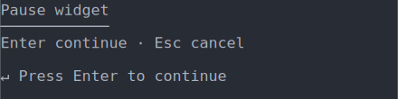</td>
  </tr>
  <tr>
    <td align="right"><strong>ASCII</strong></td>
    <td>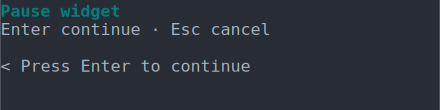</td>
    <td>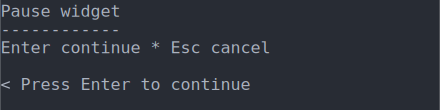</td>
  </tr>
</table>

## Panels and navigation

The interactive TUI is a full-screen panel browser: the root hub lists the form's panels with live value summaries, and each panel lists its fields with their current values and provenance badges. Up/Down move the cursor, Enter edits a field (or drills into a sub-panel), Esc goes back, `q` quits, and the mouse wheel scrolls long panels without moving the cursor - all of these keys are configurable (see [Key bindings](#key-bindings)). **Submit** and **Cancel** buttons live on the root panel - `->buttons(FALSE)` hides them, `->buttons(TRUE, 'Save', 'Discard')` relabels them.

A form-level `->banner()` shows a start screen (with an optional version) before the panels, and `->clearOnExit(FALSE)` keeps the final frame on screen after the TUI exits.

### Nested panels

Panels nest to any depth: a sub-panel renders as a drillable row with a one-line summary of its values, and the breadcrumb header tracks where you are. A `->fixup()` rule reconciles dependent answers on every settle pass - here, CDN is forced off outside production, whatever was answered:

```php
$form = Form::create('Site settings')
  ->buttons(TRUE, 'Save', 'Discard')
  ->fixup(new Fixup(set: 'cdn', to: FALSE, when: new Condition('environment', ne: 'prod')))
  ->panel('stack', 'Stack', function (PanelBuilder $p): void {
    $p->select('environment', 'Environment')->default('dev')->option('dev', 'Development', 'Local containers')->option('stage', 'Staging', 'Shared preview')->option('prod', 'Production', 'Live traffic');
    $p->confirm('cdn', 'Serve via CDN?')->default(TRUE);

    $p->panel('services', 'Services', function (PanelBuilder $sp): void {
      $sp->multiselect('services', 'Enabled services')->options(['solr' => 'Solr', 'redis' => 'Redis', 'clamav' => 'ClamAV']);

      $sp->panel('tuning', 'Tuning', function (PanelBuilder $tp): void {
        $tp->suggest('php_memory', 'PHP memory limit')->default('256M')->options(['128M' => '128M', '256M' => '256M', '512M' => '512M']);
      });
    });
  });
```

<p align="center">
  
</p>

## Display modes

The TUI adapts to the terminal: glyphs follow the locale (a `UTF` locale in `LC_ALL`, `LC_CTYPE` or `LANG` enables Unicode, anything else falls back to ASCII) and colour honours [`NO_COLOR`](https://no-color.org/) and `TERM=dumb`. Force either on the form with `->unicode(TRUE|FALSE)` and `->color(TRUE|FALSE)`. Here is the same scaffolder in each combination:

<table align="center">
  <tr>
    <td></td>
    <td align="center"><strong>ANSI</strong></td>
    <td align="center"><strong>No ANSI</strong></td>
  </tr>
  <tr>
    <td align="right"><strong>Unicode</strong></td>
    <td></td>
    <td></td>
  </tr>
  <tr>
    <td align="right"><strong>ASCII</strong></td>
    <td></td>
    <td></td>
  </tr>
</table>

## Configuration

A form is a tree of panels, each holding fields, built fluently. Rules are named-argument spec objects, so the IDE completes them and a typo fails at declaration time:

```php
use DrevOps\Tui\Builder\Form;
use DrevOps\Tui\Builder\PanelBuilder;
use DrevOps\Tui\Condition\Condition;
use DrevOps\Tui\Derive\Derive;

$form = Form::create('My form')
  ->panel('general', 'General', function (PanelBuilder $p): void {
    // text | select | multiselect | suggest | confirm
    // number | textarea | password | search | multisearch | pause
    $p->text('name', 'Project name')->required();

    // Compute one field from others.
    $p->text('machine_name', 'Machine name')->derive(new Derive('{{name}}', transform: 'machine'));

    $p->select('profile', 'Profile')
      ->default('standard')
      ->options(['standard' => 'Standard', 'custom' => 'Custom']);

    // Shown only when the condition holds; compose with Condition::all()/any()/not().
    $p->text('profile_custom', 'Custom profile')->when(new Condition('profile', eq: 'custom'));
  });
```

Each field builder chains `->description()`, `->default()`, `->required()`, `->weight()`, `->options()` / `->option()` (with per-option descriptions), `->when(new Condition(...))`, `->derive(new Derive(...))`, `->discover(...)`, `->validate(...)` and `->transform(...)`.

Form-level methods tune the interactive TUI: `->theme()` names a theme, auto-detected from the terminal background when unset (see [Themes](#themes)), `->banner()` sets a start banner, `->buttons()` controls the submit/cancel buttons, `->clearOnExit()` keeps or clears the final frame, and `->color()` / `->unicode()` force a [display mode](#display-modes).

### Derived values

A `Derive` computes a field from other answers: a template with `{{field}}` placeholders plus a transform. A transform is any [str2name](https://github.com/AlexSkrypnyk/str2name) conversion (`machine`, `kebab`, `pascal`, ...) plus `host`, `lower`, `upper` and `initials` - an unknown name throws when the form is declared. Chains of derives settle to a fixpoint:

```php
$p->text('machine_name', 'Machine name')->derive(new Derive('{{name}}', 'machine'));
$p->text('package', 'Composer package')->derive(new Derive('{{vendor}}/{{machine_name}}', 'lower'));
$p->text('namespace', 'PHP namespace')->derive(new Derive('{{name}}', 'pascal'));
```

### Conditional fields

A `->when()` rule shows or hides a field based on other answers, with operators `eq` / `ne` / `in` / `contains`, composable with `Condition::all()`, `Condition::any()` and `Condition::not()`:

```php
$p->text('docker_image', 'Docker base image')->default('php:8.4-cli')->when(new Condition('features', contains: 'docker'));
$p->confirm('docker_compose', 'Generate a docker-compose.yml?')->when(Condition::all(new Condition('features', contains: 'docker'), new Condition('type', eq: 'application')));
```

A form-level `->fixup(new Fixup(set: ..., to: ..., when: ...))` reconciles dependent answers on every settle pass, so an answer that no longer makes sense after another change is corrected instead of leaking through.

## Field behaviour

Behaviour beyond a static value is declared on the field itself - a dynamic default, validation and a value transform as closures, right in the form:

```php
use DrevOps\Tui\Handler\Context;

$p->text('name', 'Project name')
  ->default(fn(Context $c): string => basename($c->directory))
  ->validate(fn(mixed $v): ?string => is_string($v) && trim($v) !== '' ? NULL : 'A name is required.')
  ->transform(fn(mixed $v): mixed => is_string($v) ? trim($v) : $v);
```

Reusable validators and transformers live as public static methods on a consumer class. Reference one explicitly with a first-class callable - `->validate(Webroot::validate(...))` - or let the engine discover it: registering a namespace (`new Tui($form, ['App\\Handler'])`) resolves the class by field id (`machine_name` -> `MachineName`) and uses its static `validate()`/`transform()` whenever the field declares none. The field declaration always wins.

The TUI only collects: it presents answers and never applies them. **Applying answers - writing files, renaming directories - is the consumer's job.** A consumer that processes answers defines its own processor interface, keeping the form for collection and the processors for side effects - one class per field can carry both its `process()` and its reusable static behaviour (this is exactly what the Vortex CLI does).

## Discovery

In update mode, `->discover()` rules detect defaults from an existing project directory: a `.env` key (`new Dotenv('KEY')`), a JSON dot-path (`new JsonValue('composer.json', 'name')`), a path check (`new PathExists('docker-compose.yml')`), a directory scan (`new Scan('modules', type: 'dir')`), or a custom `fn(Context $c): mixed` closure:

```php
$p->text('name', 'Project name')->discover(new JsonValue('composer.json', 'name'));
$p->confirm('docker', 'Uses Docker?')->discover(new PathExists('docker-compose.yml'));
```

Discovered values are badged in the summary, and explicit input (prompts or environment) always wins over discovery:

<p align="center">
  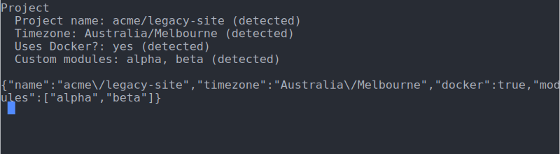
</p>

## Headless collection

Without a TTY - or when prompts are supplied - the same form collects non-interactively: answers come from a JSON payload (a string or a path to a file), per-question environment overrides and the declared defaults, with derives, conditions and fix-ups settled exactly as in the TUI.

```php
$answers = $tui->collect('{"name":"Ada"}');
$answers = $tui->run($prompts, '1.0.0'); // TUI on a terminal, headless otherwise.
```

Environment overrides are named `<PREFIX><FIELD_ID>` (the uppercased field id). `->envPrefix('MYAPP_')` declares that namespace on the form, a `new Tui($config, [], 'MYAPP_')` constructor argument overrides it, and without either the prefix is `TUI_`:

```bash
MYAPP_TIMEZONE=UTC php my-installer.php
```

For automation and AI agents, the form describes itself: `schema()` emits a JSON schema of the questions, `agentHelp()` a plain-text guide for driving the form non-interactively, and `validate($answers)` checks a payload against the schema before collection.

## Self-describing answers

The returned `Answers` set needs no form configuration to present or process: each answer carries a snapshot of its question (label, kind, weight, panel trail) taken at collection time, plus its provenance - default, detected, edited, derived, or override (a user value pinning a derived one). `$answers->toSummary()` prints the provenance-badged, panel-grouped summary, `$answers->toJson()` the raw values, and `$answers->items` exposes the per-answer snapshots.

## Themes

A theme is a self-contained class that owns the entire visual representation - the palette (per-role ANSI style codes), the glyphs (marker, caret, scroll indicators, separators - each a Unicode/ASCII pair) and how every row is composed. `AbstractTheme` implements all of it with a neutral base, and a concrete theme overrides only what it colours. The `ThemeManager` turns a theme name into an instance; two themes are built in:

```php
use DrevOps\Tui\Theme\ThemeManager;

ThemeManager::create('dark');   // bright foregrounds for a dark terminal
ThemeManager::create('light');  // higher-contrast foregrounds for a light terminal
```

When a form sets no theme (or the explicit `'auto'` sentinel), the interactive TUI picks `dark` or `light` from the actual terminal background: it queries the background colour over OSC 11, falls back to the `COLORFGBG` environment variable, and settles on `dark` when neither answers. An explicit `->theme('dark')` or `->theme('light')` opts out of detection.

A custom theme subclasses a built-in theme (e.g. `DarkTheme`) or `AbstractTheme`, overrides the styles or glyphs it changes and merges the rest from the parent - roles it does not mention keep working:

```php
use DrevOps\Tui\Theme\DarkTheme;

class OceanTheme extends DarkTheme {
  protected function defineStyles(): array {
    return ['title' => '1;96', 'value' => '96', 'marker' => '1;96'] + parent::defineStyles();
  }
}
```

Override any `render*` method to change how an element is laid out. Lowest friction: a form names the class directly, with no registration:

```php
$form = Form::create('My form')->theme('\App\OceanTheme')/* ... */;
```

Or register a short alias with `ThemeManager::register('ocean', OceanTheme::class)`, then `->theme('ocean')` - an unknown theme name fails loudly instead of silently falling back. Here is the [playground's ocean theme](playground/2-custom-theme) with a start banner:

<p align="center">
  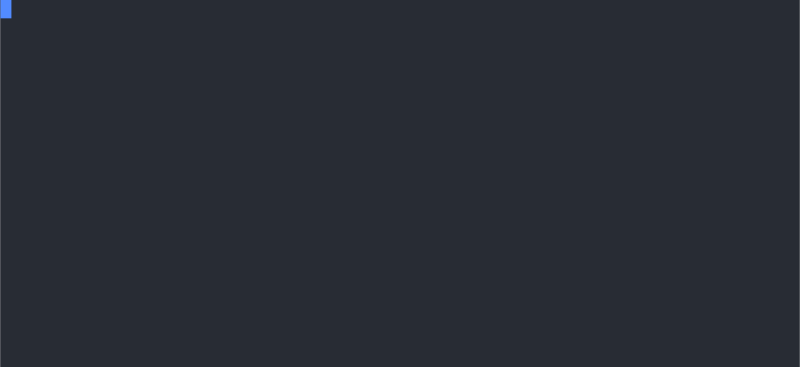
</p>

## Key bindings

Navigation, edit, accept and cancel keys are configurable. A widget asks for a semantic **action** - `MoveUp`, `Accept`, `Toggle`, `NewLine` and so on - rather than a fixed key, and a **key map** binds each action to one or more keys. Set it on the form with `->keys(...)`, mirroring `->theme(...)`:

```php
$form = Form::create('My form')->keys('vim');   // built-in vim navigation (h/j/k/l)
```

Two presets ship: `default` (the bindings described in [Panels and navigation](#panels-and-navigation)) and `vim`, which adds `h`/`j`/`k`/`l` alongside the arrow keys - only where a letter is not typed input, so text and filter fields keep the arrows.

### Per-widget-type overrides

Bindings are layered by **scope**: a base layer shared by every widget, a navigation layer for the panel browser, and one layer per widget type that overrides the base only where it differs (Enter inserts a newline in a textarea, Space toggles a checkbox option). Retune individual bindings by passing overrides on top of a preset - each names a scope, an action and its keys:

```php
use DrevOps\Tui\Config\FieldType;
use DrevOps\Tui\Input\Action;
use DrevOps\Tui\Input\Binding;
use DrevOps\Tui\Input\KeyName;
use DrevOps\Tui\Input\Scope;

$form = Form::create('My form')->keys('default', [
  // Quit with x as well as q.
  new Binding(Scope::navigation(), Action::Quit, 'x'),
  // In the single-choice list, Tab accepts too.
  new Binding(Scope::field(FieldType::Select), Action::Accept, KeyName::Tab, KeyName::Enter),
]);
```

A binding's keys accept a `KeyName` for a named key or a single-character string for a printable one. The panel and editor hints are drawn from the live bindings, so they always reflect the active keys.

### Presets and validation

A preset is a class listing its bindings. Subclass `DefaultKeyMap` to ship your own, name it directly with `->keys('\App\MyKeyMap')`, or register a short alias with `KeyMapManager::register('mine', MyKeyMap::class)` and then `->keys('mine')`.

Bindings are validated when the form is built, so a bad key map is caught at declaration time, not mid-session:

- a key bound to two different actions in the same scope is a conflict;
- a printable character bound in the base scope, or in a scope whose widget consumes typed input (text, search, checkbox), would be un-typeable and is rejected;
- an unknown preset name, or a character binding that is not exactly one character, is rejected.

See [`playground/8-key-bindings`](playground/8-key-bindings) for the default map, the vim preset and a custom override side by side.

## Playground

Runnable, self-contained examples are in [`playground/`](playground): a minimal form, a full "package scaffolder", a custom-theme demo, per-widget demos, nested panels with fix-ups, update-mode discovery, theme auto-detection, theme options, and a configurable key-bindings demo. Each is independent - copy one as a starting point.

The SVG demos on this page are generated from the playground scripts with `php docs/util/update-assets.php` (requires `asciinema`, `expect`, `node` and `npm`), which records each demo through a scripted terminal session and renders the recordings to SVG.

## Architecture

Diagrams of the engine, the collection lifecycle and the panel TUI are in [`docs/architecture/`](docs/architecture).

## Maintenance

    composer install
    composer lint
    composer test

## Updating

To pull the latest infrastructure from the template into this project, ask Claude Code to "update scaffold" - see [`AGENTS.md`](AGENTS.md) for details.

---
