<p align="center">
  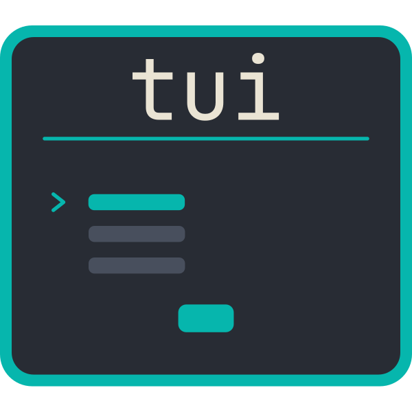
</p>

<h1 align="center">Terminal user interfaces for PHP</h1>

<div align="center">

[](https://github.com/drevops/tui/issues)
[](https://github.com/drevops/tui/pulls)
[](https://github.com/drevops/tui/actions/workflows/test-php.yml)
[](https://codecov.io/gh/drevops/tui)


</div>

---

<p align="center">
  <picture>
    <source media="(prefers-color-scheme: dark)" srcset="docs/assets/bordered-panels-dark-animated.svg">
    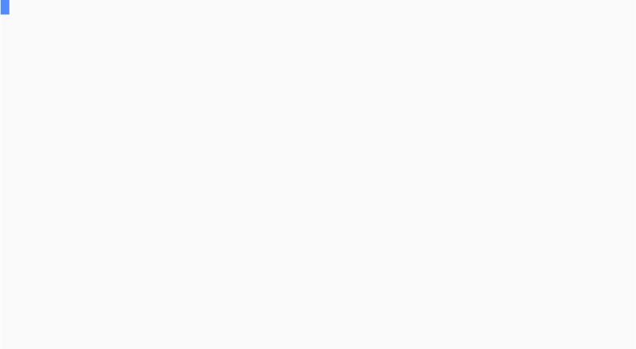
  </picture>
</p>

This is a PHP engine for building **terminal user interfaces** - the keyboard-driven forms that walk someone through a set of questions and hand the answers back to your code. You describe the questions in PHP with a fluent builder, drop in a handler class wherever a question needs real behaviour, and the engine does the rest: a scrollable, themeable TUI when there's a person at the keyboard, or a straight non-interactive read from a JSON payload when there isn't. It travels light, with barely any dependencies.

The engine deliberately knows nothing about the application it serves. It stays generic, your application-specific questions and handlers live in your code, and **what happens to the answers afterwards is your job, not the TUI's**. It collects; you apply.

That border is optional. Here's the same form without one, at normal spacing:

<p align="center">
  <picture>
    <source media="(prefers-color-scheme: dark)" srcset="docs/assets/borderless-panels-dark-animated.svg">
    
  </picture>
</p>

## 📖 Documentation

The full documentation - every widget, all the configuration, theming, key bindings and how the engine fits together - lives at **[phptui.dev](https://phptui.dev)**.

- 🧭 [**Full-screen TUI**](https://phptui.dev/panels) - a scrollable, keyboard-driven form with a contextual key-hint footer and a `?` help overlay
- ⚡ [**Inline editing**](https://phptui.dev/panels#inline-editing) - a field's editor opens in place on the panel row (the widget's own view and keys), no separate screen; opt a field out to full-screen with `->standalone()`
- 🧩 [**Widgets**](https://phptui.dev/widgets) - field types for text, numbers, dates, choices, file browsing, fuzzy search and gates
- 🏗️ [**Builder-driven**](https://phptui.dev/configuration) - the form is declared in PHP with a fluent builder
- 🎛️ [**Interactive or unattended**](https://phptui.dev/headless-collection) - answer the form by keyboard, or supply the answers up front as a JSON payload and environment variables so it runs without prompting
- 🔗 [**Derived values**](https://phptui.dev/configuration#derived-values) and 🔀 [**conditional fields**](https://phptui.dev/configuration#conditional-fields) that settle to a fixpoint
- 🔍 [**Discovery**](https://phptui.dev/discovery), ⚙️ [**declared behaviour**](https://phptui.dev/field-behaviour) and 📦 [**self-describing answers**](https://phptui.dev/self-describing-answers)
- 🎨 [**Themes**](https://phptui.dev/themes), ⌨️ [**key bindings**](https://phptui.dev/key-bindings) and ✨ [**Unicode and ASCII**](https://phptui.dev/display-modes) display modes
- 🧪 [**Test harness**](https://phptui.dev/testing) - drive a form from scripted keystrokes and assert on the answers and rendered output
- 🌍 [**Translations**](https://phptui.dev/translations) - present chrome and questions in another language, falling back to English

## Installation

```bash
composer require drevops/tui
```

## Quick start

Declare a form with the fluent `Form` builder, then drive it through the `Tui` facade - the one class that wires up the engine, resolver, schema tools and TUI so you don't have to:

```php
use DrevOps\Tui\Builder\Form;
use DrevOps\Tui\Builder\PanelBuilder;
use DrevOps\Tui\Tui;

$form = Form::create('My form')
  ->panel('general', 'General', fn(PanelBuilder $p) => $p->text('name', 'Your name')->required());

$tui = new Tui($form, handler_namespaces: ['App\\Handler']);

// Interactive on a terminal, non-interactive otherwise.
$answers = $tui->run();

// Or call a mode directly:
echo $tui->collect('{"name":"Ada"}')->toJson();  // non-interactive: JSON + environment
$answers = $tui->interact();                     // interactive TUI
```

Read the [full guide at phptui.dev](https://phptui.dev), and browse [`playground/`](playground) when you want complete, runnable examples to poke at.

## Widgets

There's a widget for most things you'd want to ask: text entry, numbers and dates, single and multiple choice, fuzzy search, filesystem browsing, and simple gates. Each one links to its full reference on [phptui.dev](https://phptui.dev/widgets), and every card below plays back the real interaction in whichever colour scheme - light or dark - your reader is using.

<table>
<tr>
<td width="50%"><picture><source media="(prefers-color-scheme: dark)" srcset="docs/assets/widget-calendar-dark-animated.svg">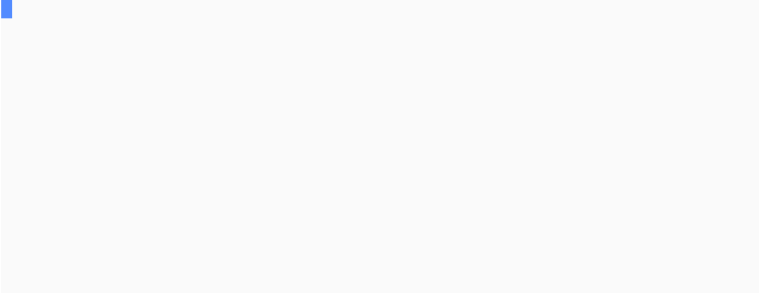</picture></td>
<td><strong><a href="https://phptui.dev/widgets/calendar">Calendar</a></strong><br>A month calendar returning a normalized ISO <code>YYYY-MM-DD</code>; arrows move by day and week.</td>
</tr>
<tr>
<td width="50%"><picture><source media="(prefers-color-scheme: dark)" srcset="docs/assets/widget-confirm-dark-animated.svg"></picture></td>
<td><strong><a href="https://phptui.dev/widgets/confirm">Confirm</a></strong><br>Yes/No toggle; arrows or Space switch, <code>y</code>/<code>n</code> set the choice directly, Enter accepts.</td>
</tr>
<tr>
<td width="50%"><picture><source media="(prefers-color-scheme: dark)" srcset="docs/assets/widget-filepicker-dark-animated.svg">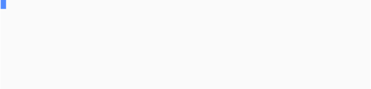</picture></td>
<td><strong><a href="https://phptui.dev/widgets/filepicker">File picker</a></strong><br>Browse the filesystem for a single path; arrows move, <code>→</code> enters a directory and <code>←</code> returns to its parent.</td>
</tr>
<tr>
<td width="50%"><picture><source media="(prefers-color-scheme: dark)" srcset="docs/assets/widget-multifilepicker-dark-animated.svg"></picture></td>
<td><strong><a href="https://phptui.dev/widgets/multifilepicker">Multi file picker</a></strong><br>Like the file picker, but several paths accumulate as you browse; <code>Space</code> toggles the highlighted entry.</td>
</tr>
<tr>
<td width="50%"><picture><source media="(prefers-color-scheme: dark)" srcset="docs/assets/widget-multisearch-dark-animated.svg"></picture></td>
<td><strong><a href="https://phptui.dev/widgets/multisearch">MultiSearch</a></strong><br>A multi-select whose filter query shows as a search line; typing fuzzy-matches and ranks, Space toggles matches.</td>
</tr>
<tr>
<td width="50%"><picture><source media="(prefers-color-scheme: dark)" srcset="docs/assets/widget-multiselect-dark-animated.svg">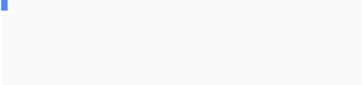</picture></td>
<td><strong><a href="https://phptui.dev/widgets/multiselect">MultiSelect</a></strong><br>Multiple choice from a checkbox list; Space toggles, typing narrows the list, select-all and deselect-all in one key.</td>
</tr>
<tr>
<td width="50%"><picture><source media="(prefers-color-scheme: dark)" srcset="docs/assets/widget-number-dark-animated.svg"></picture></td>
<td><strong><a href="https://phptui.dev/widgets/number">Number</a></strong><br>Integer entry (digits with an optional leading minus) accepted as an <code>int</code>, with optional min, max and step.</td>
</tr>
<tr>
<td width="50%"><picture><source media="(prefers-color-scheme: dark)" srcset="docs/assets/widget-password-dark-animated.svg"></picture></td>
<td><strong><a href="https://phptui.dev/widgets/password">Password</a></strong><br>Text rendered as a mask in the editor, the field row and the summary; the accepted value stays plain for the consumer, and can be made revealable.</td>
</tr>
<tr>
<td width="50%"><picture><source media="(prefers-color-scheme: dark)" srcset="docs/assets/widget-pause-dark-animated.svg"></picture></td>
<td><strong><a href="https://phptui.dev/widgets/pause">Pause</a></strong><br>An acknowledgement gate; Enter or Space accepts. Unattended runs auto-acknowledge it, so it never blocks automation.</td>
</tr>
<tr>
<td width="50%"><picture><source media="(prefers-color-scheme: dark)" srcset="docs/assets/widget-reorder-dark-animated.svg"></picture></td>
<td><strong><a href="https://phptui.dev/widgets/reorder">Reorder</a></strong><br>Rank a list by moving items into the order you want; Space picks an item up, arrows carry it through the list, Enter accepts.</td>
</tr>
<tr>
<td width="50%"><picture><source media="(prefers-color-scheme: dark)" srcset="docs/assets/widget-search-dark-animated.svg">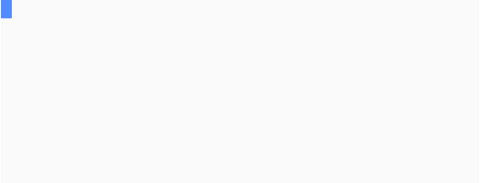</picture></td>
<td><strong><a href="https://phptui.dev/widgets/search">Search</a></strong><br>Single choice with a visible filter line; typing fuzzy-matches and ranks the labels, exact and prefix matches leading.</td>
</tr>
<tr>
<td width="50%"><picture><source media="(prefers-color-scheme: dark)" srcset="docs/assets/widget-select-dark-animated.svg"></picture></td>
<td><strong><a href="https://phptui.dev/widgets/select">Select</a></strong><br>Single choice from a list; arrows move, Enter accepts the highlighted option, long lists page around the cursor.</td>
</tr>
<tr>
<td width="50%"><picture><source media="(prefers-color-scheme: dark)" srcset="docs/assets/widget-suggest-dark-animated.svg">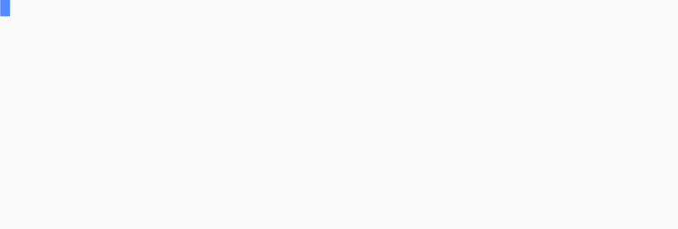</picture></td>
<td><strong><a href="https://phptui.dev/widgets/suggest">Suggest</a></strong><br>Free text with autocomplete over a fixed option set: as you type, suggestions are fuzzy-matched and ranked by relevance.</td>
</tr>
<tr>
<td width="50%"><picture><source media="(prefers-color-scheme: dark)" srcset="docs/assets/widget-text-dark-animated.svg"></picture></td>
<td><strong><a href="https://phptui.dev/widgets/text">Text</a></strong><br>Single-line input with a movable caret; type to insert, arrows move, Backspace deletes, Enter accepts.</td>
</tr>
<tr>
<td width="50%"><picture><source media="(prefers-color-scheme: dark)" srcset="docs/assets/widget-textarea-dark-animated.svg">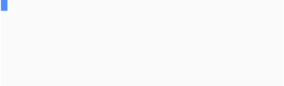</picture></td>
<td><strong><a href="https://phptui.dev/widgets/textarea">Textarea</a></strong><br>Multi-line input; Enter inserts a newline, arrows move between lines, Tab accepts, with an external-editor handoff.</td>
</tr>
<tr>
<td width="50%"><picture><source media="(prefers-color-scheme: dark)" srcset="docs/assets/widget-toggle-dark-animated.svg"></picture></td>
<td><strong><a href="https://phptui.dev/widgets/toggle">Toggle</a></strong><br>An inline switch between two labelled values; arrows or Space flip, the first letter of each label sets it directly.</td>
</tr>
</table>

## Themes

The TUI is themeable. Six themes ship built-in, selected by name on the `Tui` facade - and any of them can be forced light or dark, or left to auto-detect from the terminal:

```php
$tui = (new Tui($form))->theme('midnight');
```

| Name | Palette |
|------|---------|
| `default` | Cyan accents on an auto-detected dark or light base - the out-of-the-box look. |
| `midnight` | Violet accents, green values, pink highlights. |
| `frost` | Arctic frost-blue accents, sage values, sand highlights. |
| `ember` | Burnt-orange accents, olive values, gold highlights. |
| `mono` | Hue-free - bold weight, grey levels and reverse video for maximum compatibility. |
| `dos` | Retro MS-DOS: the bright white/cyan/yellow CGA palette in a double-line window, made for a blue terminal background. |

Each renders across every widget and degrades to plain text without ANSI. Every theme adapts to the terminal - here the dark palette (left) and the light palette (right):

**`midnight`**

<p>
  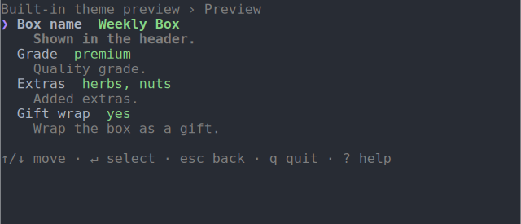
  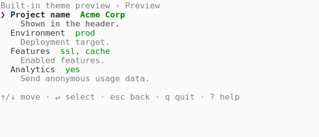
</p>

**`frost`**

<p>
  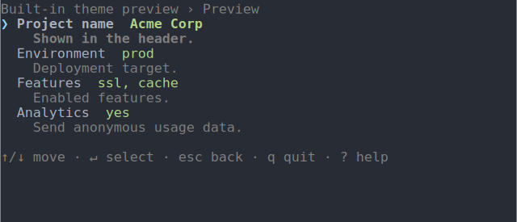
  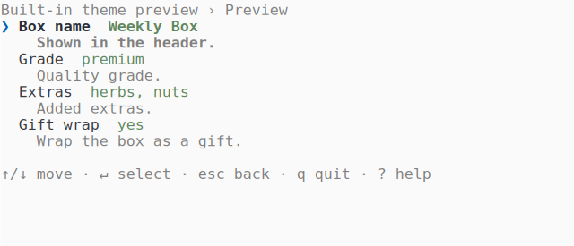
</p>

**`ember`**

<p>
  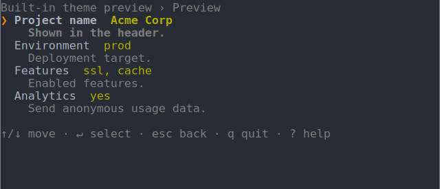
  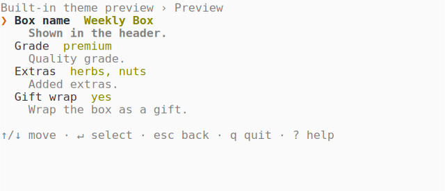
</p>

**`mono`**

<p>
  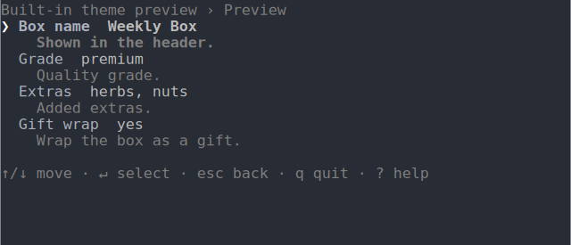
  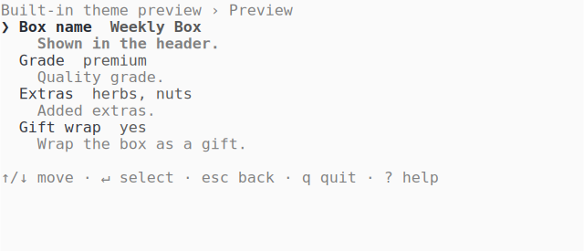
</p>

**`dos`** - the CGA blue screen, painted regardless of the terminal background

<p>
  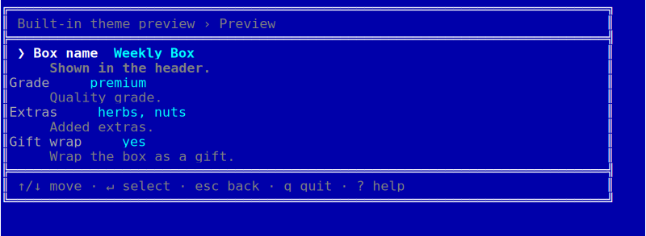
</p>

Write your own by subclassing `DefaultTheme` and overriding just its palette - see the [theming guide](https://phptui.dev/themes).

## Maintenance

```bash
composer install
composer lint
composer test
```

See the [Contributing guide](https://phptui.dev/contributing) when you're ready to dig into the full development workflow.

---
_This repository was created using the [Scaffold](https://getscaffold.dev/) project template_
