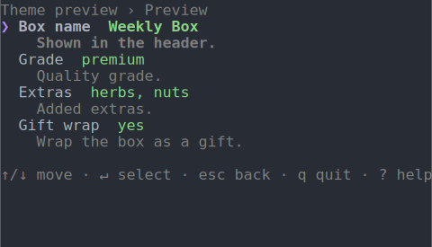
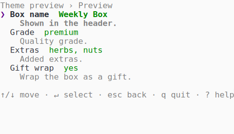
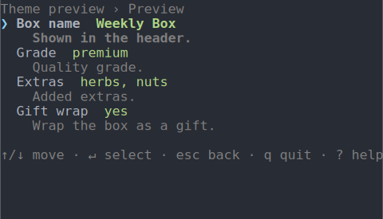
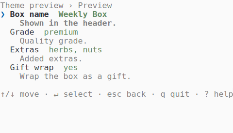
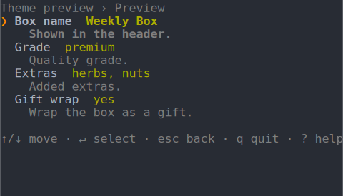
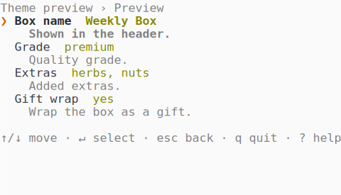
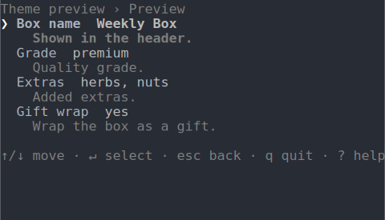
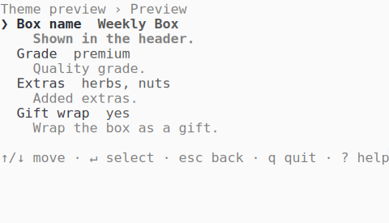
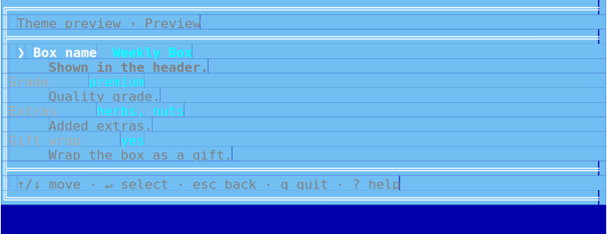

<p align="center">
  
</p>

<h1 align="center">Terminal user interfaces for PHP</h1>

<div align="center">

[](https://github.com/drevops/tui/issues)
[](https://github.com/drevops/tui/pulls)
[](https://github.com/drevops/tui/actions/workflows/test-php.yml)
[](https://codecov.io/gh/drevops/tui)


</div>

---

<p align="center">
  <picture>
    <source media="(prefers-color-scheme: dark)" srcset="docs/assets/bordered-panels-dark-animated.svg">
    
  </picture>
</p>

`drevops/tui` is a PHP engine for panel-based terminal forms: keyboard-driven questionnaires that collect a set of answers and hand them back to the caller as typed values.

- **Declarative form model.** A form is declared with a fluent builder (`Form` / `PanelBuilder` / `FieldBuilder`): panels of typed fields, each field a widget with its own options, conditions, derivation rules and behaviour.
- **Two collection modes, one declaration.** The same form runs as a full-screen interactive TUI on a terminal, or resolves non-interactively from a JSON payload, per-field environment variables, discovery rules and defaults.
- **Application-agnostic.** The engine knows nothing about the application it serves; questions and handlers live in the consumer, and applying the collected answers is the consumer's job. It collects; you apply.
- **Dependency-light.** The runtime dependency surface is a single string-transform package.

The border above is a display option. The same form at the default borderless look, normal spacing:

<p align="center">
  <picture>
    <source media="(prefers-color-scheme: dark)" srcset="docs/assets/borderless-panels-dark-animated.svg">
    
  </picture>
</p>

## 📖 Documentation

Full documentation lives at **[phptui.dev](https://phptui.dev)**. The in-development build, rebuilt from `main` ahead of each release, is previewed at **[tui-docs.netlify.app](https://tui-docs.netlify.app/)**.

## Features

Every feature has a reference page and a runnable, self-contained example in [`playground/`](playground):

| Feature | Summary | Docs | Example |
|---|---|---|---|
| 🧭 Full-screen TUI | Scrollable panel browser: hubs drill into sub-panels to any depth, contextual key-hint footer, `?` help overlay | [panels](https://phptui.dev/panels) | [`03-panels`](playground/03-panels) |
| 🪟 Modal panels | A panel marked `->modal()` opens as a centered dialog over its dimmed parent, with its own submit/cancel buttons | [panels](https://phptui.dev/panels#modal-panels) | [`03-panels`](playground/03-panels) |
| ⚡ Inline editing | A field's editor opens in place on the panel row; `->standalone()` opts a field out to full-screen | [panels](https://phptui.dev/panels#inline-editing) | [`04-inline-editing`](playground/04-inline-editing) |
| 🧩 Widgets | 13 field types: text, number, calendar, textarea, password, select, reorder, suggest, search, file picker, confirm, toggle, pause | [widgets](https://phptui.dev/widgets) | [`02-widgets`](playground/02-widgets) |
| 🏗️ Builder-driven | The form is declared in PHP with a fluent builder; the common cases need no code | [configuration](https://phptui.dev/configuration) | [`01-quickstart`](playground/01-quickstart) |
| 🎛️ Interactive or unattended | `run()` picks the mode: keyboard on a terminal, otherwise JSON payload + `TUI_<ID>` environment variables | [headless collection](https://phptui.dev/headless-collection) | [`05-headless`](playground/05-headless) |
| 🔗 Derived values | Fields computed from other answers via `{{field}}` templates and str2name transforms, settling to a fixpoint | [configuration](https://phptui.dev/configuration#derived-values) | [`06-form-logic`](playground/06-form-logic) |
| 🔀 Conditional fields | `->when()` conditions (eq/ne/in/contains, composable with all/any/not) drive visibility; form-level fix-ups reconcile answers | [configuration](https://phptui.dev/configuration#conditional-fields) | [`06-form-logic`](playground/06-form-logic) |
| ⚙️ Declared behaviour | Dynamic defaults, validation and transforms as field closures, or as per-field handler classes resolved by naming convention | [field behaviour](https://phptui.dev/field-behaviour) | [`07-field-behaviour`](playground/07-field-behaviour) |
| 🔍 Discovery | Update mode detects defaults from an existing directory: dotenv keys, JSON dot-paths, path checks, directory scans | [discovery](https://phptui.dev/discovery) | [`08-discovery`](playground/08-discovery) |
| 📦 Self-describing answers | Answers carry provenance; `toSummary()` renders a badged, panel-grouped report and `toJson()` the machine result; `schema()`, `validate()` and `agentHelp()` describe the form itself | [self-describing answers](https://phptui.dev/self-describing-answers) | [`05-headless`](playground/05-headless) |
| 🎨 Themes | Six built-ins selected by name; a custom theme is a `DefaultTheme` subclass overriding palette atoms and render methods | [themes](https://phptui.dev/themes) | [`09-themes`](playground/09-themes) |
| ⌨️ Key bindings | Presets (`default`, `vim`, or a class) plus per-binding overrides scoped to navigation or a widget type; conflicts throw at setup | [key bindings](https://phptui.dev/key-bindings) | [`10-key-bindings`](playground/10-key-bindings) |
| ✨ Display modes | Dark/light follows the terminal background, glyphs follow the locale, colour honours `NO_COLOR`; all three can be forced | [display modes](https://phptui.dev/display-modes) | [`11-display-modes`](playground/11-display-modes) |
| 🧪 Test harness | `TuiTester` drives the real panel loop from scripted keystrokes, no TTY; assert on answers, output and rendered frames | [testing](https://phptui.dev/testing) | [`12-testing`](playground/12-testing) |
| 🌍 Translations | A `Translator` with per-language catalog files localizes chrome and questions, falling back to English | [translations](https://phptui.dev/translations) | [`13-translations`](playground/13-translations) |

## Installation

```bash
composer require drevops/tui
```

## Quick start

Declare a form with the `Form` builder, then drive it through the `Tui` facade - the one class that wires the engine, resolver, schema tools and TUI:

```php
use DrevOps\Tui\Builder\Form;
use DrevOps\Tui\Builder\PanelBuilder;
use DrevOps\Tui\Tui;

$form = Form::create('My form')
  ->panel('general', 'General', fn(PanelBuilder $p) => $p->text('name', 'Your name')->required());

$tui = new Tui($form, handler_namespaces: ['App\\Handler']);

$answers = $tui->run();
```

The facade's surface:

| Call | Purpose |
|---|---|
| `run($prompts, $version, $directory, $interactive)` | Collect answers; interactive on a TTY, headless otherwise (or forced via `$interactive`) |
| `collect($prompts, $directory, $update, $version)` | Headless collection from JSON + environment; `$update` enables discovery |
| `interact()` | The interactive panel TUI, explicitly |
| `schema()` / `validate($answers)` / `agentHelp()` | Describe the form as a JSON schema, validate a payload against it, emit agent-facing instructions |
| `theme($name, $options)` / `keys($preset, $overrides)` | Select the theme and key bindings |
| `color($bool)` / `unicode($bool)` / `footer($bool)` / `clearOnExit($bool)` / `translator($t)` | Display and runtime switches |
| `form()` / `engine()` / `registry()` | The internals, for finer control |

Read the [full guide at phptui.dev](https://phptui.dev), and browse [`playground/`](playground) for complete, runnable examples - one directory per feature in the table above.

## Widgets

There's a widget for most things you'd want to ask: text entry, numbers and dates, single and multiple choice, fuzzy search, filesystem browsing, and simple gates. Each one links to its full reference on [phptui.dev](https://phptui.dev/widgets), and every card below plays back the real interaction in whichever colour scheme - light or dark - your reader is using.

<table>
<tr>
<td width="50%"><picture><source media="(prefers-color-scheme: dark)" srcset="docs/assets/widget-calendar-dark-animated.svg"></picture></td>
<td><strong><a href="https://phptui.dev/widgets/calendar">Calendar</a></strong><br>A month calendar returning a normalized ISO <code>YYYY-MM-DD</code>; arrows move by day and week.</td>
</tr>
<tr>
<td width="50%"><picture><source media="(prefers-color-scheme: dark)" srcset="docs/assets/widget-confirm-dark-animated.svg"></picture></td>
<td><strong><a href="https://phptui.dev/widgets/confirm">Confirm</a></strong><br>Yes/No toggle; arrows or Space switch, <code>y</code>/<code>n</code> set the choice directly, Enter accepts.</td>
</tr>
<tr>
<td width="50%"><picture><source media="(prefers-color-scheme: dark)" srcset="docs/assets/widget-filepicker-dark-animated.svg"></picture></td>
<td><strong><a href="https://phptui.dev/widgets/filepicker">File picker</a></strong><br>Browse the filesystem for a path; arrows move, <code>→</code> enters a directory and <code>←</code> returns to its parent. Add <code>-&gt;multiple()</code> for several paths.</td>
</tr>
<tr>
<td width="50%"><picture><source media="(prefers-color-scheme: dark)" srcset="docs/assets/widget-number-dark-animated.svg"></picture></td>
<td><strong><a href="https://phptui.dev/widgets/number">Number</a></strong><br>Integer entry (digits with an optional leading minus) accepted as an <code>int</code>, with optional min, max and step.</td>
</tr>
<tr>
<td width="50%"><picture><source media="(prefers-color-scheme: dark)" srcset="docs/assets/widget-password-dark-animated.svg"></picture></td>
<td><strong><a href="https://phptui.dev/widgets/password">Password</a></strong><br>Text rendered as a mask in the editor, the field row and the summary; the accepted value stays plain for the consumer, and can be made revealable.</td>
</tr>
<tr>
<td width="50%"><picture><source media="(prefers-color-scheme: dark)" srcset="docs/assets/widget-pause-dark-animated.svg"></picture></td>
<td><strong><a href="https://phptui.dev/widgets/pause">Pause</a></strong><br>An acknowledgement gate; Enter or Space accepts. Unattended runs auto-acknowledge it, so it never blocks automation.</td>
</tr>
<tr>
<td width="50%"><picture><source media="(prefers-color-scheme: dark)" srcset="docs/assets/widget-reorder-dark-animated.svg"></picture></td>
<td><strong><a href="https://phptui.dev/widgets/reorder">Reorder</a></strong><br>Rank a list by moving items into the order you want; Space picks an item up, arrows carry it through the list, Enter accepts.</td>
</tr>
<tr>
<td width="50%"><picture><source media="(prefers-color-scheme: dark)" srcset="docs/assets/widget-search-dark-animated.svg"></picture></td>
<td><strong><a href="https://phptui.dev/widgets/search">Search</a></strong><br>Single choice with a visible filter line; typing fuzzy-matches and ranks the labels, exact and prefix matches leading.</td>
</tr>
<tr>
<td width="50%"><picture><source media="(prefers-color-scheme: dark)" srcset="docs/assets/widget-select-dark-animated.svg"></picture></td>
<td><strong><a href="https://phptui.dev/widgets/select">Select</a></strong><br>Single choice from a list; arrows move, Enter accepts the highlighted option, long lists page around the cursor.</td>
</tr>
<tr>
<td width="50%"><picture><source media="(prefers-color-scheme: dark)" srcset="docs/assets/widget-suggest-dark-animated.svg"></picture></td>
<td><strong><a href="https://phptui.dev/widgets/suggest">Suggest</a></strong><br>Free text with autocomplete over a fixed option set: as you type, suggestions are fuzzy-matched and ranked by relevance.</td>
</tr>
<tr>
<td width="50%"><picture><source media="(prefers-color-scheme: dark)" srcset="docs/assets/widget-text-dark-animated.svg"></picture></td>
<td><strong><a href="https://phptui.dev/widgets/text">Text</a></strong><br>Single-line input with a movable caret; type to insert, arrows move, Backspace deletes, Enter accepts.</td>
</tr>
<tr>
<td width="50%"><picture><source media="(prefers-color-scheme: dark)" srcset="docs/assets/widget-textarea-dark-animated.svg"></picture></td>
<td><strong><a href="https://phptui.dev/widgets/textarea">Textarea</a></strong><br>Multi-line input; Enter inserts a newline, arrows move between lines, Tab accepts, with an external-editor handoff.</td>
</tr>
<tr>
<td width="50%"><picture><source media="(prefers-color-scheme: dark)" srcset="docs/assets/widget-toggle-dark-animated.svg"></picture></td>
<td><strong><a href="https://phptui.dev/widgets/toggle">Toggle</a></strong><br>An inline switch between two labelled values; arrows or Space flip, the first letter of each label sets it directly.</td>
</tr>
</table>

## Themes

Six themes ship built-in, selected by name on the `Tui` facade. Dark or light is a separate `mode` display option auto-detected from the terminal background, so every adaptive theme serves both:

```php
$tui = (new Tui($form))->theme('midnight');
```

| Name | Palette |
|------|---------|
| `default` | Cyan accents on an auto-detected dark or light base - the out-of-the-box look. |
| `midnight` | Violet accents, green values, pink highlights. |
| `frost` | Arctic frost-blue accents, sage values, sand highlights. |
| `ember` | Burnt-orange accents, olive values, gold highlights. |
| `mono` | Hue-free - bold weight, grey levels and reverse video for maximum compatibility. |
| `dos` | Retro MS-DOS: the bright white/cyan/yellow CGA palette in a double-line window, made for a blue terminal background. |

Each renders across every widget and degrades to plain text without ANSI. Here the dark palette (left) and the light palette (right); the [themes docs](https://phptui.dev/themes) also show every theme inside the rounded border frame:

**`midnight`**

<p>
  
  
</p>

**`frost`**

<p>
  
  
</p>

**`ember`**

<p>
  
  
</p>

**`mono`**

<p>
  
  
</p>

**`dos`** - the CGA blue screen, painted regardless of the terminal background

<p>
  
  
</p>

Write your own by subclassing `DefaultTheme` and overriding just its palette - see the [theming guide](https://phptui.dev/themes) and the playground's [`OceanTheme`](playground/09-themes/OceanTheme.php).

## Maintenance

```bash
composer install
composer lint
composer test
```

## Contributing

See the [Contributing guide](https://tui-docs.netlify.app/contributing) for the development workflow, quality gates and how the documentation and SVG assets are built.

---
_This repository was created using the [Scaffold](https://getscaffold.dev/) project template_
