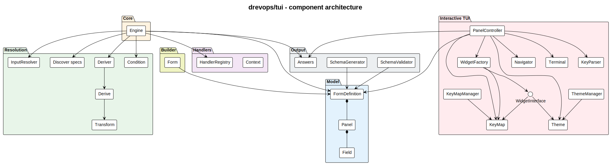
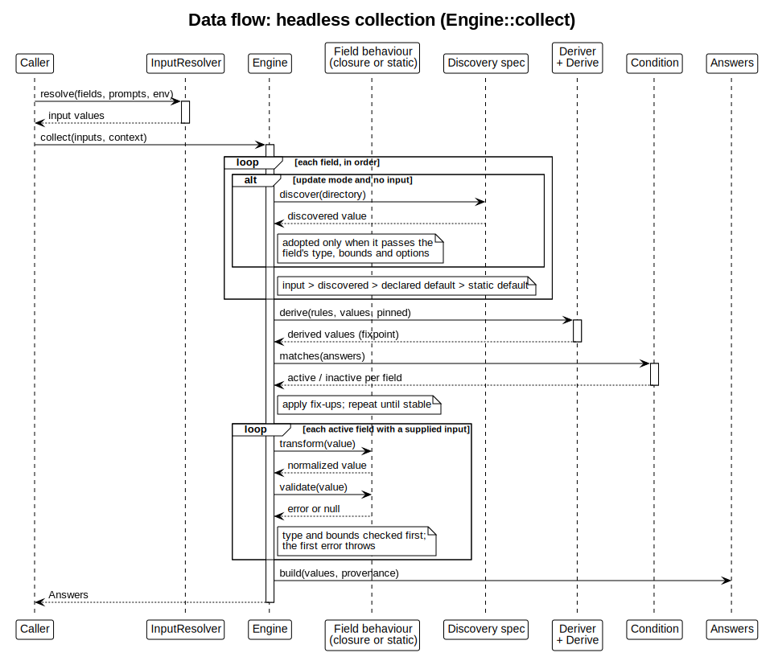
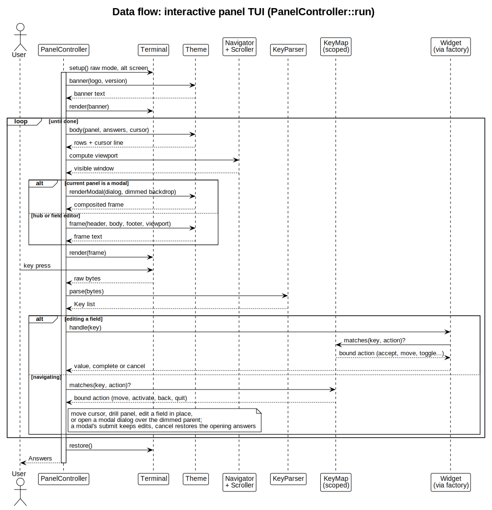

# How the TUI works

This is a walkthrough of the `drevops/tui` engine - what you assemble to build a form, and what happens when it runs. The diagrams are rendered from the PlantUML sources in this directory by the [`render-tui-diagrams`](../../.claude/skills/render-tui-diagrams/SKILL.md) skill; everything below is derived from `src/`, so if the prose and the code disagree, the code wins.

## The shape of it

At the centre is the **Engine**. Everything else is either something you hand it (a configuration, a set of handlers, a theme) or something it produces (validated answers, a JSON schema). The packages below mirror the `src/` subdirectories, and the arrows are the main dependencies.

<picture>
  <source media="(prefers-color-scheme: dark)" srcset="architecture-dark.svg">
  
</picture>

Read it in three bands:

- **Left - what you provide.** A **FormDefinition** (assembled by the fluent `Form` builder into `FormDefinition` -> `Panel` -> `Field`) and, optionally, **Handlers** (classes that carry behaviour). The global TUI runtime - theme, key bindings, colour and language - is configured on the `Tui` facade and shared by every form. Together these declare the questions, how each one behaves, and how the TUI presents them.
- **Middle - the Engine and its helpers.** The Engine drives collection, leaning on `InputResolver` (read a payload), `Discovery` (detect from the directory), `Deriver` + `Transform` (compute values), and the `Condition` rules (decide what is shown).
- **Right - what comes out, and how it is shown.** `Answers` (plus a `SchemaGenerator` / `SchemaValidator` for agents and forms), and the **interactive TUI** - `PanelController` composing a `Theme` (resolved by name through `ThemeManager`), a `KeyMap` (resolved by preset through `KeyMapManager`), widgets, a `Navigator` and a `Terminal`.

## Step 1 - describe the questions

You declare the questions in PHP with the fluent `Form` builder: panels holding fields. A field has an `id`, a `type` (text, select, suggest, search, file picker, confirm - the select, search and file picker types collecting a list with `->multiple()`) and optional rules - `default`, `required`, `options`, `when` (show it only when a condition holds), `derive` (compute it from other fields) and `discover` (detect it from the target directory). The builder validates the declaration - rejecting duplicate field ids - and builds the immutable `FormDefinition` model. The global TUI runtime is configured on the `Tui` facade instead, not the form. Nothing runs yet; this is pure description.

## Step 2 - attach behaviour where you need it

Most fields need no code. When one does - a dynamic default, discovery, validation or a normalisation - declare it on the field itself: `->default(fn ...)`, `->validate(fn ...)`, `->transform(fn ...)`, `->discover(...)`. Reusable validators and transformers are public static methods on a consumer class named after the field id (`machine_name` -> `MachineName`) in a registered namespace - referenced explicitly as first-class callables or discovered by the engine as the fallback; the field declaration wins when both exist.

## Step 3 - collect the answers

`Engine::collect()` turns the config plus whatever the caller supplied into a settled set of answers. This is the heart of the engine:

<picture>
  <source media="(prefers-color-scheme: dark)" srcset="dataflow-collect-dark.svg">
  
</picture>

Walking the sequence:

1. **Resolve each field's starting value**, in priority order: an explicit input (from `--prompts` or the environment, via `InputResolver`) beats a discovered value (in update mode, adopted only when it passes the field's type, bounds and options), which beats a handler's dynamic `default()`, which beats the static default in the config.
2. **Transform each supplied input** through its declared or handler behaviour, so derivation, activation and fix-ups all evaluate the normalized value. Defaults and derived values are the configuration's own and skip the transformers.
3. **Settle the derived and conditional fields.** `Deriver` recomputes `derive` values (with `Transform`) until they stop changing, the `Condition` rules decide which fields are active from their `when` declarations, and fix-ups reconcile dependents - repeated until the whole set is stable.
4. **Validate each active supplied input** - the type and bounds are checked first, and the first error throws.
5. **Emit `Answers`** - the values plus their provenance (default, detected, edited, derived, override).

The same lifecycle runs whether the caller is a human at the TUI or a script passing JSON, which is why the engine is testable without a terminal.

## Step 4 - let a person answer (optional)

For interactive use, `PanelController::run()` seeds itself with the engine's resolved answers and drives a panel TUI until the user is done:

<picture>
  <source media="(prefers-color-scheme: dark)" srcset="dataflow-tui-dark.svg">
  
</picture>

The theme instance comes from `ThemeManager` - a registry keyed by name ("default", a registered short name, or a theme class name directly). Colour, Unicode and the dark/light mode are display options: anything the form leaves unset is detected from the terminal, with the mode picked from the terminal background (an OSC 11 query answered by the `Terminal`, then `COLORFGBG`, then a dark default). Each turn the controller asks the **Theme** to compose a frame (the theme owns colours, glyphs and layout - including the chrome-height budget that sizes the body viewport to the terminal), computes the visible window with the `Navigator` and `Scroller`, and renders it to the `Terminal`. A panel that declares `->layout()` renders its sub-panels as a grid of side-by-side preview columns instead of the row list - each level of the tree declares its own arrangement, and the arrows then navigate the grid spatially. With the `fullscreen` option on, the frame stretches to the whole terminal (capped by `max_width`/`max_height`): the theme aligns the body block inside it per the `halign`/`valign` options, the controller positions any smaller frame in the screen through the same `Overlay` placement the modals use, and below the minimum size (measured from the content unless `min_width`/`min_height` say otherwise) a centered resize notice takes the frame's place until the terminal grows. A key press is parsed by `KeyParser` into a `Key`, which a **KeyMap** resolves to a semantic action (move, accept, toggle, quit...) rather than a fixed key - the bindings behind each action are configurable per widget type, ship a vim preset alongside the default, and are validated when `->keys()` resolves the key map - at declaration time, not mid-session. Armed with the action, the controller either moves the cursor / drills into a sub-panel, or opens a widget to edit a field - inline in the panel by default, the widget's view taking the place of the field's value in the row, or full-screen for a `->standalone()` field under a theme-composed underlined label header. The widget consults the same key map and renders through the theme, and an accept enforces the field's declared or handler-resolved `validate()`/`transform()` - the same behaviour the headless path applies - showing a rejection inline and writing the accepted value back marked "edited". A panel can instead be declared modal with `->modal()`: activating it opens the panel as a centered dialog composited over the dimmed parent - the `Theme` boxes it narrower than the frame and `Overlay` splices it on top - with its own configurable submit/cancel buttons, where submit keeps the edits and cancel or Escape restores the answers the dialog opened with. When the user finishes, it returns the same `Answers` object the headless path produces.

No widget extends another widget. Each one composes its behaviour from the capabilities in `Widget\Capability` - an interface per capability (`OptionsCapableInterface`, `SelectionCapableInterface`, `FilterCapableInterface`, `SearchCapableInterface`, `PagingCapableInterface`, `TextEditCapableInterface`, `CompletionCapableInterface`, `StepCapableInterface`, `RevealCapableInterface`, `ExternalEditCapableInterface`) paired with the trait carrying its default implementation (`OptionsCapableTrait`, `FilterCapableTrait`, ...) - so the controller and the tests interact with a capability - "is this widget filterable, can it page" - rather than a concrete class.

## Step 5 - apply the answers (the consumer's job)

Collecting produces answers; acting on them - writing files, renaming directories - is the consumer's job, never the engine's. A consumer that processes answers defines its own processor contract with a `process()` hook, resolves each processor class by field id through the `HandlerRegistry`, and orders the work by the per-field `weight` metadata (ties in reverse declaration order). One class per field can carry both its `process()` and the reusable static `validate()`/`transform()` the engine discovers. This is the pattern a consumer CLI follows with its own `ProcessorInterface` and `Processor`.

## Regenerating this document

The diagrams are PlantUML (`.puml`) rendered to a light `.svg`, each with a dark `-dark.svg` variant derived from it. After editing a source, re-render and re-derive, and keep this walkthrough in step with any structural change:

    plantuml -tsvg docs/architecture/*.puml
    node docs/util/derive-dark-diagram.js docs/architecture/*.svg

The [`render-tui-diagrams`](../../.claude/skills/render-tui-diagrams/SKILL.md) skill covers rendering, adding a new data-flow diagram, and keeping this walkthrough current.
